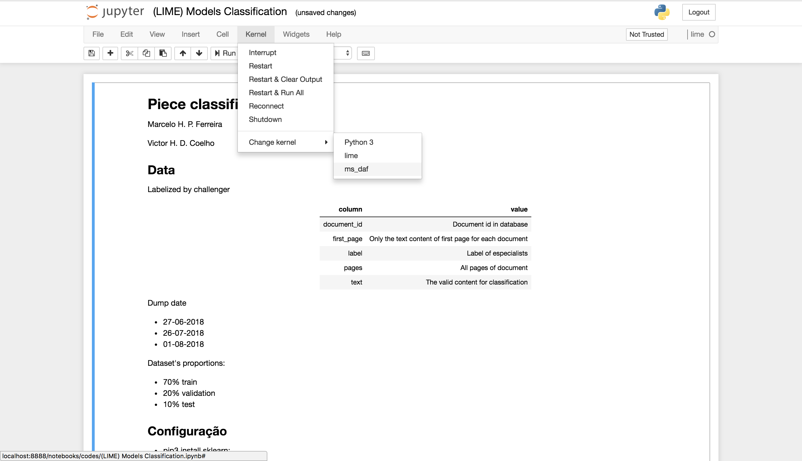

# PBE-R
Prática Baseada em Evidência - R

# Preparação do Ambiente
1. Instalar o python3 via gerenciador de pacote do Sistema Operacional
 
    ```bash
      # MacOS X
      $ brew install python3
      
      # Linux
      $ apt-get install python3
    ```
    
1. Remover o elo (link) do python2 para tornar o python3 como default

    ```bash
      # MacOS X
      $ nano ~/.bash_profile
      
      # Ubuntu
      $ nano ~/.bashrc
    ```
    
    ```.bash_profile
      # bash_profile
      
      # aliases
      alias pip=pip3
      alias python=python3

      [[ -s "$HOME/.profile" ]] && source "$HOME/.profile" # Load the default .profile
     ```
     
    ```bash
      $ source ~/.bash_profile
    ```     

1. Configuração do Virtual Env (VENV)
    
    1. Criação do VENV
        ```bash
           # Vem instalado com o PIP, não precisa instalar o VirtualEnv
           $ virtualenv -p python3 venv
        ```
    
    1.  Ativando o VENV (faça isso toda vez que for executar o projeto)
        ```bash
            $ source venv/bin/activate
        ```

1. Instalando as dependências com as versões unificadas

    ```bash
        $ pip install -r requirements.txt
    ```
    
1. Criando o Kernel para o jupyter para que ele "visualize" as dependências instaladas

    ```bash
        $ ipython kernel install --user --name=ms_daf
    ```
    
1. Selecionando o Kernel no Jupyter

    
    
1. __SE NÃO INSTALAR CORRETAMENTE SIGA OS PRÓXIMOS PASSOS__

1. Instalar o jupyter (execute esses comandos com o VENV ativo)

    ```bash
      # Todos Sistemas Operacionais
      $ pip install jupyter notebook
      $ pip freeze > requirements.txt
    ```

1. Instalando a dependencia da computação em núvem (floydhub):

    ```bash
      # Todos Sistemas Operacionais
      $ pip install -U floyd-cli
    ```       

1. Com o __ambiente ativo__, instale o tensorflow

    ```bash
      # Todos Sistemas Operacionais
      $ pip install --ignore-installed --upgrade https://storage.googleapis.com/tensorflow/mac/cpu/tensorflow-1.9.0-py3-none-any.whl
    ```

1. Instalar o gerenciador de extensões do jupyter

    ```bash
        $ pip install jupyter_contrib_nbextensions
    ``` 

1. [Install R support](http://www.storybench.org/install-r-jupyter-notebook/)
1.1. Run R commands just starting R console at terminal: ```$ r```

# Instalando pacotes R

1. RJDBC: install.packages("RJDBC")
1. DBI database connector: ```install.packages("DBI")```
1. ODBC install: ```install.packages("odbc")```
1. DevTools: ```install.packages("devtools")```

# R Using JDBC

1. Install JDK
1. Install RJDBC: ```install.packages("RJDBC")```
1. [Download JDBC Oracle](https://download.oracle.com/otn/utilities_drivers/jdbc/121020/ojdbc7.jar?AuthParam=1565034251_6986a513108eca59af3f5b9db995a5ca)
1. Move JDBC to C:/
1. Code to acces:
```
 llibrary(RJDBC)
driver <- JDBC(driverclass = "oracle.jdbc.oracleDriver", "C:/ojdbc7.jar")
con <- dbConnect(driver, "jdbc:oracle:thin:@//IP:PORT:SCHEMA", "usr", "pwd")
```

# RStudio EnvVar IF error (mac, works on Windows)
1. Sys.setenv("JDBC"="~/ojdbc8.jar")
1. Sys.setenv("ORACLE_USR"="...")
1. Sys.setenv("ORACLE_PWD"="...")

# Mac ODBC:
1. https://db.rstudio.com/best-practices/drivers/
1. MySQL Tutorial: https://db.rstudio.com/databases/my-sql/
1. [iODBC](http://www.iodbc.org/dataspace/doc/iodbc/wiki/iodbcWiki/Downloads#Stable%20Version%203.52.12)
1. [MySQL](https://dev.mysql.com/downloads/connector/odbc/)

# Windows ODBC Drivers:
1. [MySQL](https://dev.mysql.com/downloads/connector/odbc/)
1. [PostGres](https://www.postgresql.org/ftp/odbc/versions/msi/)
1. [Oracle (buscar por ODBC](https://www.oracle.com/database/technologies/instant-client/winx64-64-downloads.html)


__OBSERVAÇÃO: Não atualize (upgrade) o pip! O tensorflow 1.9 é compatível com o pip instalado neste processo!__ Caso faça o Upgrade, execute o comando a seguir, com o env ativo:

```bash
 $ sudo pip install --force-reinstall pip==10.0.1
```
    
__Se aparecer stacktrace no import do tensorflow no arg async significa que existem 2 pythons interpreters rodando o tensorflow e você deve executar um uninstall do tensorflow fora do env conda__:

```bash
 $ deactivate
 $ pip uninstall tensorflow
```
